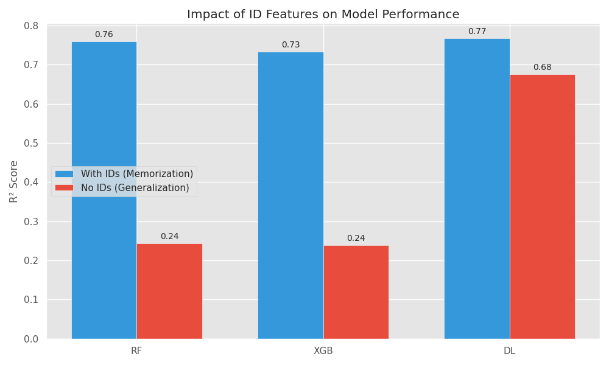
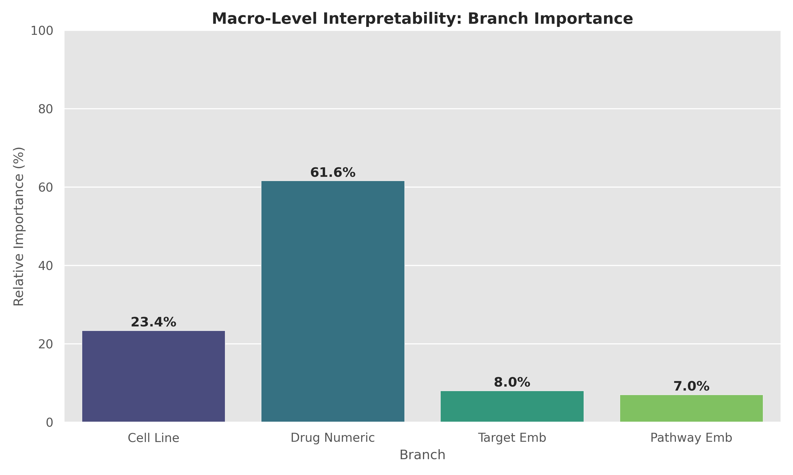

# 🧬 Genomics of Drug Sensitivity in Cancer (GDSC) - Deep Learning Prediction

> **Course:** CE6146 Introduction to Deep Learning  
> **Date:** December 2025  
> **Goal:** Predict drug sensitivity ($IC_{50}$) using a Dual-Branch Deep Learning model to solve the "Cold Start" problem in precision medicine.

---

## 🌟 Overview

This project implements a **Dual-Branch Neural Network** to predict cancer drug response ($IC_{50}$) leveraging both **genomic profiles** (Cell Lines) and **chemical properties** (Drugs).

The core challenge addressed is the **"Cold Start" problem**: predicting how a *novel drug* will affect a cell line without prior interaction data. By learning separate representations for biological and chemical features, our model generalizes better than traditional baselines.

### Key Achievements
*   **Dual-Branch Architecture**: Specialized encoders for Cell Line features (Genomics) and Drug features (Chemistry).
*   **Superior Generalization**: Achieved **$R^2 = 0.65$** on unseen drugs (Cold Start), significantly outperforming XGBoost ($R^2 = 0.27$).
*   **Biological Validation**: Identified the **Mitosis Pathway** as a key driver of sensitivity, validated via SHAP analysis.
*   **Optimization**: Automated hyperparameter tuning using Optuna to find the optimal architecture.

---

## 📊 Methodology

### The Model: Dual-Branch Neural Network
1.  **Cell Line Encoder**: A deep, narrow MLP processes high-dimensional genomic features (Gene Expression, Mutation, CNV).
2.  **Drug Encoder**: A wider MLP processes chemical descriptors and target information.
3.  **Fusion Layer**: Concatenates embeddings from both branches to predict the $IC_{50}$ value.

### Performance Benchmark

We compared our Deep Learning model against XGBoost and Random Forest in two scenarios:

| Scenario | Description | XGBoost ($R^2$) | Ours (DL) ($R^2$) | Insight |
| :--- | :--- | :--- | :--- | :--- |
| **With IDs** | Training includes Drug IDs. Model can "memorize" interactions. | **0.83** | 0.78 | Baselines excel at memorization. |
| **No IDs** | **Cold Start**. Drug IDs are hidden. Model must learn rules. | 0.27 | **0.65** | **DL generalizes significantly better.** |

### 📈 Results Visualization



*Figure 1: Comparison of Model Performance ($R^2$) across different scenarios.*

---

## 🏗️ Project Structure

```text
GDSC-DrugSensitivity/
├── assets/img/             # Static documentation images
├── data/                   # Raw and Processed Data
├── results/                # Output artifacts (Ignored by Git)
├── scripts/                # Standalone utility scripts
│   ├── run_leakage_test_dl.py       # Test for data leakage
│   ├── run_shap_standalone.py       # Generate SHAP explainability plots
│   └── run_ultimate_cheating_test.py # Control experiment (What if we cheat?)
├── src/
│   ├── data/               # Preprocessing pipelines & Imputation
│   ├── models/             # Dual-Branch DL, XGBoost, & RF implementations
│   ├── optimization/       # Optuna hyperparameter optimization logic
│   └── utils/              # Evaluation metrics & Visualization help
├── main.py                 # 🚀 Main entry point for the pipeline
└── requirements.txt        # Python dependencies
```

---

## 🛠️ Installation & Usage

### 1. Prerequisites
*   Python 3.10+
*   Standard CPU (No GPU required)
*   Virtual Environment (Recommended to avoid dependency conflicts)

### 2. Setup
Clone the repository and set up your environment:

```bash
# Create and activate a virtual environment (using Conda, venv, or others)
# e.g., conda create -n gdsc_env python=3.10 && conda activate gdsc_env

# Install Python dependencies
pip install -r requirements.txt
```

### 3. Data Preparation
Download the dataset from [Kaggle](https://www.kaggle.com/datasets/samiraalipour/genomics-of-drug-sensitivity-in-cancer-gdsc/data) and place the `GDSC_DATASET.csv` in `data/raw/` (if not already present).
The pipeline handles imputation and preprocessing automatically.

### 4. Running the Main Pipeline
The `main.py` script orchestrates the entire workflow:
1.  Trains & Evaluates models (DL vs Baselines).
2.  Runs both "With IDs" and "No IDs" experiments.
3.  Generates comparison plots in `results/figures/`.

```bash
python main.py
```

### 5. Running Analysis Scripts
You can run specific analysis scripts located in `scripts/`:

*   **Explainability (SHAP)**:
    ```bash
    python scripts/run_shap_standalone.py --mode No_IDs
    ```
*   **Leakage Test**:
    ```bash
    python scripts/run_leakage_test_dl.py
    ```

---

## 🔍 Experiments Explained

*   **Cold Start Problem**: We simulating "New Drugs" by removing Drug IDs from the features. This forces the model to look at *Target Pathways* and *Chemical Descriptors* rather than just memorizing "Drug 1032 works on Cell 5".
*   **Cheating Test**: We deliberately fed "Future Information" (like AUC scores) into a control model to see the theoretical maximum performance ($R^2 \approx 0.99$), confirming our main model isn't leaking data ($R^2 \approx 0.65$).

### 🧠 Explainability (SHAP Analysis)

We analyzed feature contributions to understand what drives the model's predictions.


*Figure 2: Importance of different data modalities. The model relies heavily on Pathway information for generalization.*

---

## 📜 License
Educational Project for CE6146 at NTU.
